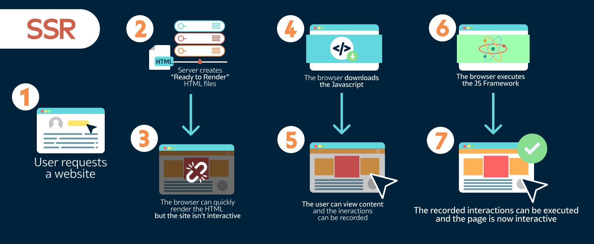

This is a [Next.js](https://nextjs.org/) project bootstrapped with [`create-next-app`](https://github.com/vercel/next.js/tree/canary/packages/create-next-app).

# Nextjs

This project is a nextjs app ,Nextjs is a **React** frontend development web framework created by Vercel that enables functionality such as server-side rendering and static site generation

# What is SERVER-SIDE RENDERING (SSR)

Unlike a traditional react app where the entire application is loaded and rendered on the client, Nextjs allows the first page load to be rendered by the server,which is great for SEO and performance.
ps: keep in mind the fewer the dependencies used the lighter the app and the higher performance your app will be .



# Benefits of the NEXTjs

- Easy page routing (like in the html you just create the page you will go with the name **like** store.js => url/store)

- API Routes

- Out of the box TypeScript and Sass (you can use ts and sass in your app)

- Static site generation

- Easy Deployment (vercel.com just import you github repo)

## https://nextjs-project-rho-eight.vercel.app/

First, run the development server:

```bash
npm run dev
# or
yarn dev
```

Open [http://localhost:3000](http://localhost:3000) with your browser to see the result.

You can start editing the page by modifying `pages/index.js`. The page auto-updates as you edit the file.

[API routes](https://nextjs.org/docs/api-routes/introduction) can be accessed on [http://localhost:3000/api/hello](http://localhost:3000/api/hello). This endpoint can be edited in `pages/api/hello.js`.

The `pages/api` directory is mapped to `/api/*`. Files in this directory are treated as [API routes](https://nextjs.org/docs/api-routes/introduction) instead of React pages.

## Learn More

To learn more about Next.js, take a look at the following resources:

- [Next.js Documentation](https://nextjs.org/docs) - learn about Next.js features and API.
- [Learn Next.js](https://nextjs.org/learn) - an interactive Next.js tutorial.

You can check out [the Next.js GitHub repository](https://github.com/vercel/next.js/) - your feedback and contributions are welcome!

## Deploy on Vercel

The easiest way to deploy your Next.js app is to use the [Vercel Platform](https://vercel.com/new?utm_medium=default-template&filter=next.js&utm_source=create-next-app&utm_campaign=create-next-app-readme) from the creators of Next.js.

Check out our [Next.js deployment documentation](https://nextjs.org/docs/deployment) for more details.
